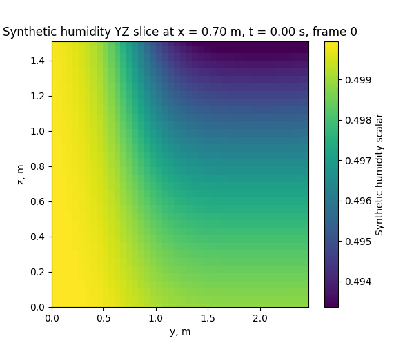
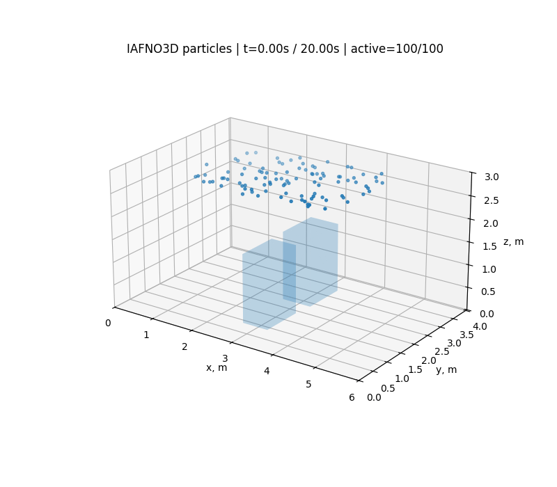

# CFD and IAFNO Animation Gallery

This page keeps the generated animations separate from the main README. Each animation is labeled by its computational source so OpenFOAM results and IAFNO predictions are not confused.

## CFD8 — OpenFOAM baseline

### Humidity y–z slice visualization

This animation is the CFD8 humidity visualization path. It should not be interpreted as a fully coupled OpenFOAM humidity-transport solution.



### OpenFOAM particles with CAD collision

Particles are advanced through the calculated OpenFOAM velocity field. Segment–triangle intersection tests stop trajectories from passing through the CAD surface.


## CFD10 — first applied IAFNO particle rollout

The U/p IAFNO model is rolled forward beyond the CFD training horizon. Lagrangian particles are integrated through its predicted velocity field.



## CFD11 — U/p/T IAFNO temperature

This x–z slice shows temperature predicted by the U/p/T IAFNO branch. Humidity was loaded/exported in the surrounding workflow but excluded from the saved IAFNO training state.


## CFD12 — Zone 01

### Temperature prediction

The temperature slice uses the real DXF-derived Zone 01 geometry and FFU-based boundary setup developed in CFD12.


### Lagrangian particle prediction

Particles are traced through the CFD12 IAFNO rollout with room-domain and CAD checks.


## Earlier animations not present in the notebook archives

The standalone CFD1–CFD7A GIF files were saved outside the notebooks and were not embedded in the uploaded archives. They can be added later from the Windows animation folder:

```text
C:\Users\brian\OneDrive\桌面\ASE\cleanroom\animation
```

Expected filenames:

- `educational_2d_cfd_velocity_16080.gif`
- `educational_2d_cfd_humidity_16080.gif`
- `educational_2d_cfd_temperature_16080.gif`
- `educational_2d_cfd_L particles1_16080.gif`
- `3d_particles_boundary_only.gif`
- `3d_temperature_boundary_only.gif`
- `3d_particles_CAD.gif`
- `3d_temperature_CAD_along_x.gif`
- `3d_temperature_CAD_along_y.gif`

CFD4 and CFD5 reference the same particle GIF filename, so a later run may have overwritten the earlier animation.
